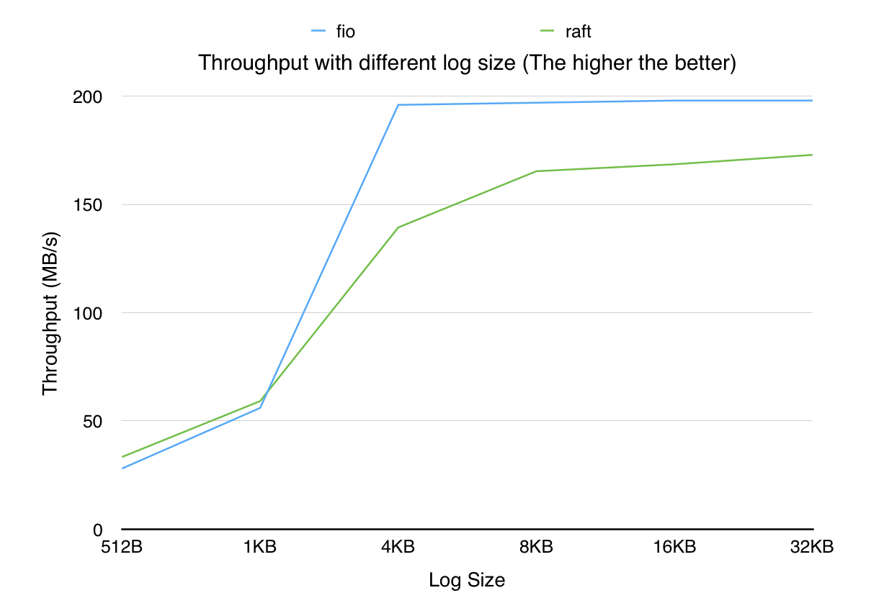
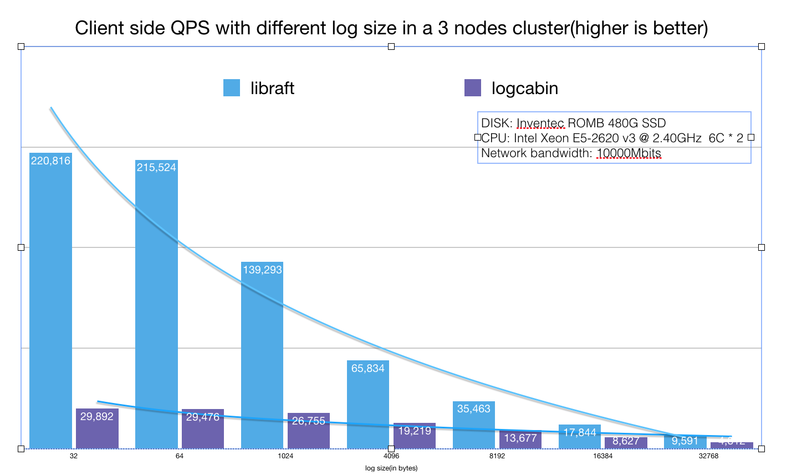

# 前言

几乎所有的框架、模块、类库， 都会把高性能作为最重要的标签之一(当然， braft也不例外)。但是常常开发者对于性能理解只是停留在吞吐或者QPS的数字表面，性能测试变成了想方设法刷数字的游戏，而不考虑场景是否符合实际应用场景。常见的『提升性能数字』的方法有以下两类:

* **Batch:** 系统主动等request数量达到一定数量或者等一个超时时间， 合成一个request发给后端系统, 取决于batch_size / request_size 的值， 能将"QPS"提升几十~几百倍. (这点后面再详细解释)。
* **Client不限制的异步发送**: 这样能让系统一直处于高负载状态，不存在任何的等待，规避了一些系统调用和线程同步开销。

这些设计虽然能跑出不错的benchmark数据，但是完全偏离了实际的应用场景。以batch为例， batch的问题在于本质上并没有去指导如何提升系统的QPS。在性能测试中，并发度通常很高，会有源源不断的请求进来，所以每个请求并不需要等待多长时间就能满足batch size的条件, 然而在真实场景中，并发度并没有这么高，这样会导致每个请求都必须要『等待』一个设定的值， latency无法达到最优解。而这时候工程师往往会沉浸在优化超时、batch size等调参工作，从而忽略了分析系统瓶颈这类真正有意义的事情。另外硬件性能的逐渐提升，网络和磁盘本身的延迟越来越短， 这套机制无法兼顾低负载下的延迟和高负载的吞吐。

在braft中，我们主要采用了以下几点方法来提高的性能:

- 数据流是全并发的， leader写本地磁盘和向follower复制数据是完全并发的。
- 尽可能的提高局部性，充分发挥不同层面的cache的作用
- 尽可能隔离不同硬件的访问，通过流水线的形式提高吞吐
- 尽可能的降低锁临界区大小， 关键路径上采用lock-free/wait-free算法. 

# 测试场景

不同的用户状态机性能千差万别， 在这个场景中，我们先剥离用户状态机的影响，由client起多个线程通过同步RPC向server写一定大小的log，server调用libraft的接口向复制组提交日志， 当server收到raft日志成功提交的事件之后， 回复client，采集client上的吞吐和延时数据. 对比组为fio以同样的线程数顺序写本地磁盘， 通过这样的测试，我们希望能够看到，使用了raft之后，对比写本地磁盘，应用会牺牲多少的性能数据来换取更高的数据安全性.

如果没有特殊说明， 默认client的线程均为100, 写文件默认打开fsync

## vs FIO (2016.3)

fio测试命令(其中-bs=xxx会替换成测试对应的size):

```
./fio -filename=./10G.data -iodepth 100 -thread -rw=write -ioengine=libaio --direct=1 -sync=1 -bs=512 -size=10G -numjobs=1 -runtime=120 -group_reporting -name=mytest
```

 

**硬件信息**

CPU:  12核， Intel(R) Xeon(R) CPU E5-2620 v2 @ 2.10GHz  

磁盘:  LENOVO SAS 300G, 随机写IOPS~=800， 顺序写吞吐~=200M/s

网卡：万兆网卡, 未开启网卡多队列

副本数: 3



## vs Logcabin(2017.2)

由于目前业界很少有能单独使用的RAFT实现，我们对Logcabin进行了一些调整， 增加了rpc 服务并且等日志同步完成就立即回复client(patch部分即将开源).  并且统计了client端的QPS， 具体数据如下图所示。


