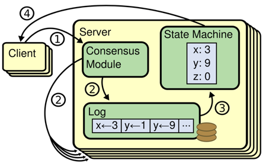
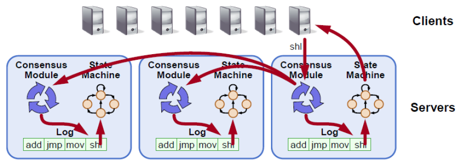

# 分布式一致性

分布式一致性(distributed consensus) 是分布式系统中最基本的问题， 用来保证一个分布式系统的可靠性以及容灾能力。简单的来讲，就是如何在多个机器间对某一个值达成一致, 并且当达成一致之后，无论之后这些机器间发生怎样的故障，这个值能保持不变。

抽象定义上， 一个分布式系统里的所有进程要确定一个值v，如果这个系统满足如下几个性质， 就可以认为它解决了分布式一致性问题, 分别是:

- Termination:  所有正常的进程都会决定v具体的值，不会出现一直在循环的进程。
- Validity: 任何正常的进程确定的值v', 那么v'肯定是某个进程提交的。比如随机数生成器就不满足这个性质.
- Agreement:  所有正常的进程选择的值都是一样的。

# 一致性状态机

对于一个无限增长的序列a[1, 2, 3…], 如果对于任意整数i, a[i]的值满足分布式一致性，这个系统就满足一致性状态机的要求。

基本上所有的系统都会有源源不断的操作, 这时候单独对某个特定的值达成一致是不够的。为了真实系统保证所有的副本的一致性，通常会把操作转化为[write-ahead-log](https://en.wikipedia.org/wiki/Write-ahead_logging)(简称WAL). 然后让系统的所有副本对WAL保持一致， 这样每个进程按照顺序执行WAL里的操作，就能保证最终的状态是一致的。

# RAFT

RAFT是一种新型易于理解的分布式一致性复制协议，由斯坦福大学的Diego Ongaro和John Ousterhout[提出](http://wiki.baidu.com/download/attachments/142056196/raft.pdf?version=1&modificationDate=1457941130000&api=v2)，作为[RAMCloud](https://ramcloud.atlassian.net/wiki/display/RAM/RAMCloud)项目中的中心协调组件。Raft是一种Leader-Based的Multi-Paxos变种，相比Paxos、Zab、View Stamped Replication等协议提供了更完整更清晰的协议描述，并提供了清晰的节点增删描述。

Raft作为复制状态机，是分布式系统中最核心最基础的组件，提供命令在多个节点之间有序复制和执行，当多个节点初始状态一致的时候，保证节点之间状态一致。系统只要多数节点存活就可以正常处理，它允许消息的延迟、丢弃和乱序，但是不允许消息的篡改（非拜占庭场景）。

Raft可以解决分布式理论中的CP，即一致性和分区容忍性，并不能解决Available的问题。其中包含分布式系统中一些通常的功能：

- Leader Election
- Log Replication
- Membership Change
- Log Compaction

# RAFT可以做什么

通过RAFT提供的一致性状态机，可以解决复制、修复、节点管理等问题，极大的简化当前分布式系统的设计与实现，让开发者只关注于业务逻辑，将其抽象实现成对应的状态机即可。基于这套框架，可以构建很多分布式应用：

- 分布式锁服务，比如Zookeeper
- 分布式存储系统，比如分布式消息队列、分布式块系统、分布式文件系统、分布式表格系统等
- 高可靠元信息管理，比如各类Master模块的HA

# 为什么要做BRAFT

当前公司的很多系统，要么存在单点问题，要么存在复制数据安全问题，要么存在复制一致性问题，要么存在复制延迟问题。这些问题使得很多系统开发维护困难，很多时候影响业务的发展。RAFT算法在很大程度上能够解决上面这些问题，高性能的CP复制框架可以解决复制的一致性和延迟问题，对于availability可以在设计中做些consistency的折中，提供多副本读取来实现高可用。

RAFT协议从2013年出来，社区涌现了非常多的[实现](http://raft.github.io/)，但是其中大部分都是实验性质的，缺乏Membership Changes和Log Compaction等功能。少数较为靠谱的实现都是作为具体Service实现的一部分，没有封装成一个通用的基础库形式。其中大部分的RAFT实现都是采用线程网络模型，即一个peer之间的连接使用一个线程维护，对于多线程的调用处理也比较粗糙，这样不适合一个进程中维护大量RAFT复制实例。

一个良好的RAFT算法实现能够对上层屏蔽细节， 让开发者从复杂的异常处理中解放出来， 专注于自己的业务逻辑，像写单机程序一样构建分布式系统。虽然RAFT算法本身虽然以易于理解著称，但是要实现正确还是得面临复杂的异常处理，并发事件，必须妥善的解决所有的race conditon以及ABA problem, 于此同时还得保证足够优秀的性能。braft在保证正确性和高性能的同时， 还需要保证接口足够的简单易用.

# Supported features of BRAFT

* Leader election.
* Replication and recovery.
* Snapshot and log compaction.
* Membership management.
* Fully concurrent replication.
* Fault tolerance.
* Asymmetric network partition tolerance.
* Workaround when quorate peers are dead.
