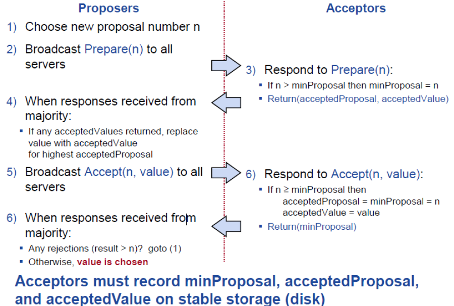
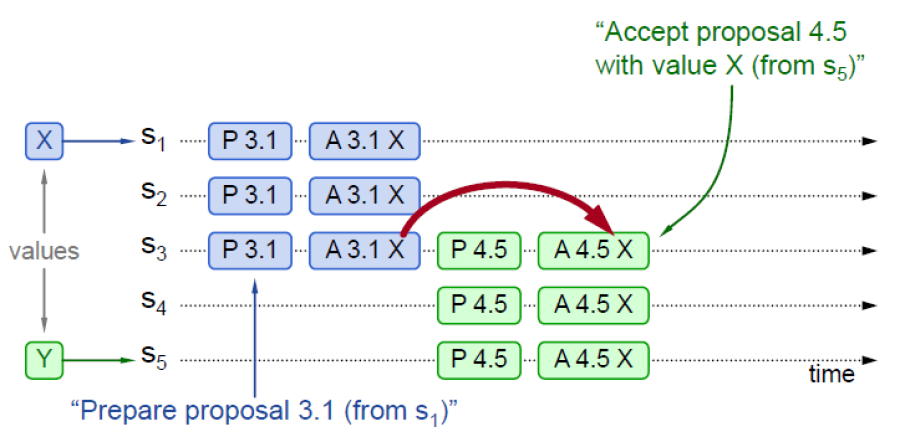
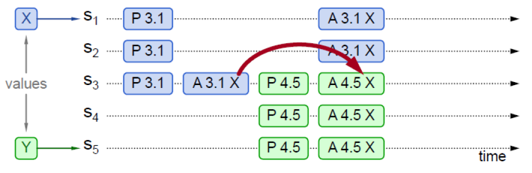
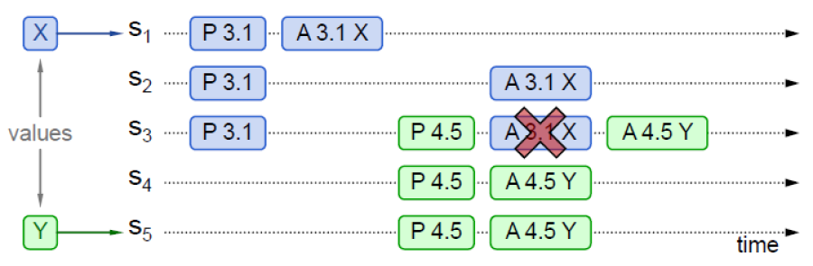

# Paxos简介

Paxos 算法解决的问题是一个分布式系统如何就某个值（决议）达成一致。一个典型的场景是，在一个分布式数据库系统中，如果各节点的初始状态一致，每个节点都执行相同的操作序列，那么他们最后能得到一个一致的状态。为保证每个节点执行相同的命令序列，需要在每一条指令上执行一个"一致性算法"以保证每个节点看到的指令一致。一个通用的一致性算法可以应用在许多场景中，是分布式计算中的重要问题。

Paxos中保证一致性的最核心的两个原则是：

- 少数服从多数
- 后者认同前者

Paxos分为两类：

- Basic Paxos：也叫single decree paxos，每次有1个或多个节点针对一个变量进行投票，确定变量的值。
- Multi Paxos：通过一系列Basic Paxos的实例来确定一系列变量的值，来实现一个Log

Paxos主要满足下面两个需求：

- Safety：一个变量只会被确定一个值，一个变量只有在值被确定之后，才能被学习
- Liveness：一些提案最终会被接受；一个提案被接受之后，最终会被学习到

Liveness的解决其实比较简单，每个Proposer引入随机超时回退，这样可以让某一个Proposer能够先进行提议，成功提交到多数，那么就可以解决活锁的问题了。

Paxos中只有对应的Proposer知道提案的值，其他Proposer如果要读取提案的值，也需要执行一遍Basic Paxos的提案才能拿到提案值。

# Basic Paxos

## Components

Paxos主要包括两个组件：Proposer和Acceptor，其中Proposer主动发起投票，Acceptor被动接收投票，并存储提案值。在实际系统中，每个Paxos Server都包含这两个组件。

## Problem

Paxos的提案过程中为了解决acceptor crash，需要多个acceptor中quorum应答才算成功，这样应答之后只要有1个节点存活提案值就是有效的。但是多个acceptor就会出现Split Votes和Conflict Chose的问题。

### Split Votes

如果Acceptor只接受第一个提案值，考虑多个Proposer同时对一个提案进行提议，那么可能任何一个Proposer都不会拿到多数应答。

这个时候Acceptor就需要允许接收多个不同的值，来解决Split Votes的问题。

### Conflicting Choices

为了解决Split Votes，Acceptor可以接受多个不同的值，如果Acceptor要接受每一个提议，那么可能不同的Proposer提议不同的值，可能都会被chosen，破坏每个提案只有一个值的原则。

这个时候就需要采用2-phase协议，对于已经chosen的值，后面的proposal必须提议相同的值。

如图S3应该拒绝S1的proposal，这样就可以保证S5的提案成功，S1的提案因为冲突而失败。需要对提议进行排序，这样Acceptor可以拒绝老的提议。

### Proposal Number

可以通过Proposal Number来唯一标示Proposal，方便Acceptor进行排序。

一个简单的Proposal Number的定义为：

Proposer保存maxRound，表示当前看到的最大Round Number，每次重新发起Proposal的时候，增加maxRound，拼接上ServerId构成Proposal Number。

Proposer需要将maxRound持久化，确保宕机之后不会重用之前的maxRound，避免生成相同的Proposal Number。

## Flow

Paxos执行过程包括两个阶段：Prepare和Accept。其中Prepare阶段用于block当前未完成的老的提案，并发现当前已经被选取的提案（如果已经提案完成或部分完成），Accept过程用于真正的进行提交提案，Acceptor需要持久化提案，但需要保证每个提案号只接受一次提案的原则。具体流程如下：

## Example

下面针对几种情况来讨论paxos的实际运行。最常见的是之前的提案已经完成，后面又有proposer又发起提案，除了提案号变化之外，提案值并没有变化：

当多个proposer并发发起提案或者是上一个proposer异常终止，都会出现提案部分完成的情况，如果新的proposer在prepare阶段看到了上一个proposer的提案值，就将其作为自己的提案值，这样即使两个proposer并发提案，依然可以保证两个proposer都成功且value是一致的：

在上面并发提案的情况下，如果新的proposer在prepare阶段没有看到上一个proposer的提案值，将提交自己新的提案值，这样老的proposer会失败，而接受新的提案值：

# Multi Paxos

Lamport并没有在论文中详细描述Multi Paxos的细节，Multi Paxos直观来看是给每个提案增加一个Index，将其组成一个顺序Basic Paxos实例流。

当收到Client的请求时处理流程如下：

1. 寻找第一个没有chosen的LogEntry
2. 针对这个LogEntry对应的Index运行Basic Paxos进行提案
3. Prepare是否返回acceptedValue？
   1. Yes：完成chosing acceptedValue，跳到1继续处理
   2. No：使用Client的Value进行Accept

通过上面的流程可以看出，每个提案在最优情况下需要2个RTT。当多个节点同时进行提议的时候，对于index的争抢会比较严重，会造成Split Votes。为了解决Split Votes，节点需要进行随机超时回退，这样写入延迟就会增加。针对这个问题，一般通过如下方案进行解决：

1. 选择一个Leader，任意时刻只有一个Proposer，这样可以避免冲突，降低延迟
2. 消除大部分Prepare，只需要对整个Log进行一次Prepare，后面大部分Log可以通过一次Accept被chosen

## Leader Election

对于Leader Election，Lamport提出了一种简单的方式：让ServerId最大的节点成为Leader。

每个节点定期T向其他节点发送心跳，如果某个节点在2T内没有收到最大ServerId节点的心跳，则变为Leader。

Leader会接收Client的请求，并扮演Proposer和Acceptor；其他节点拒绝Client的请求，只扮演Acceptor。

## Eliminating Prepares

在讨论消除Prepare请求之前，我们先讨论一下Prepare的作用：

1. 屏蔽老的Proposal：拒绝老的Proposal提议，作用域是一个Index
2. 返回可能chosen的Value：多个Proposer进行并发Proposal的时候，新的Proposal需要确保提议相同的值

在Multi-Paxos过程中，要消除Prepare是消除大多数的Prepare，但是依然需要Prepare的：

1. 屏蔽老的Proposal：拒绝老的Proposal提议，但是作用域名是整个Log，而不是单个Index
2. 返回可能chosen的Value：返回最大的Proposal Number的acceptedValue，当后面的Proposal没有acceptedValue的时候返回noMoreAccepted。

这样一个acceptor一旦用noMoreAccepted回复Prepare之后，Proposer就不需要再向其发送Prepare了。

如果Proposer拿到了多数acceptor的noMoreAccepted之后，Proposer后面的提议就不需要发送Prepare了，这样每个LogEntry只需要1个RTT的Accept就可以chosen了。

## Other

通过选主和消除Prepare之后，Multi Paxos依然不够完整，还需要解决：

- Full Replication：全部节点都需要复制得到全部的Log
- All Server Know about chosen value：全部节点需要知道Log中哪些值被chosen了
  对于Full Replication可以通过Leader一直重试Accept请求，来保证Acceptor上数据尽可能的最新。

为了通知每个节点Chosen的Value，我们增加了一些内容：

- 每个LogEntry都有一个acceptedProposal，标明提案号，一旦被Chosen，将其设置为∞。
- 每个Server都维护一个firstUnChosenIndex，表明第一个没有被Chosen的LogEntry的位置。

Proposer向Acceptor发送Accept请求的时候带上firstUnChosenIndex，这样Acceptor接收到Accept请求的时候，就可以更新本地Log中Chosen Value的范围：

- i < request.firstUnChosenIndex
- acceptedProposal[i] = request.proposal 

上面讨论的几种方式都是Leader存活期间由Leader来保证其提案值在全部节点上尽可能的被复制和被Chosen，需要考虑Leader故障之后新的Leader需要将上一个Leader尽可能但是没有完成的数据进行复制和Chosen。

- Acceptor将其firstUnChosenIndex作为Accept的应答返回给Proposer
- Proposer判断如果Acceptor.firstUnChosenIndex < local.firstUnChosenIndex，则异步发送Success RPC。

Success(index, v)用于通知Acceptor已经Chosen的Value：

- acceptedValue[index] = v
- acceptedProposal[index]=∞

Acceptor返回firstUnChosenIndex给Proposer，Proposer再继续发送Success请求来通知其他Chosen的Value。