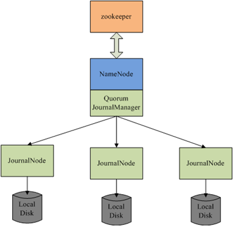

# QJM协议简介

QJM是QuorumJournalManager的简介，是Hadoop V2中的namenode的默认HA方案。qjm方案简单，只有两个组件：journal node和libqjm，qjm方案并不负责选主，选主交由外部实现，例如基于zookeeper实现。libqjm负责journal数据的读写，其中包括journal在异常情况下的一致性恢复；journalnode负责log数据的存储。

QJM的Recovery算法是一个basic paxos实现，用于协商确认最新的in progress log segment的内容（实际操作是确认log segment中的txid范围），因为已经进行了选主，写入的edit log可以按照Multi-Paxos进行优化，跳过basic paxos中的Prepare阶段直接进入Accept阶段，即向2n+1个节点写入n+1个节点返回成功即成功，来降低写入数据内容协议一致的延迟，这样其延迟为：median(Latency @JNs)。

上面的描述很简单，但是下面有很多非常有意思的问题：

1. 当一个JN收到了edit，其他节点没有收到，这个时候namenode挂掉了怎么处理？
2. 当两个namenode都声明自己是active，出现“脑裂”怎么处理？
3. 多个节点在写入过程中挂掉，如何从不一致状态中恢复？
4. Namenode在写入或者是finialized的过程中挂掉，如何从不一致状态中恢复？
5. 如果standy namenode在failover过程中挂掉，如何从不一致状态中恢复？

QJM分布式协议是基于paxos的实现，能够解决上述问题，并确保数据在节点间的一致。具体来讲，使用Multi-Paxos进行commit每批edit log，使用Paxos进行standy namenode进行failover时的recovery。

<http://blog.cloudera.com/blog/2012/10/quorum-based-journaling-in-cdh4-1/>

整体QJM的流程：

1. Fencing prior writers
2. Recovering in-progress logs
3. Start a new log segment
4. Write edits
5. Finalize log segment
6. Go to step 3

## Fencing

Fencing是分布式系统中解决“脑裂”问题的解药，新的active namenode能保证老的active namenode不会再修改系统元信息。QJM中Fencing的关键在于*epoch number*，具有如下属性：

- 当一个writer变为active，需要赋值一个epoch number
- 每个epoch number都是唯一的，两个writer不会有同一个epoch number
- Epoch number定义writer的序，epoch number越大writer越新

Epoch number的实现流程如下：

- 在开始写入edit log之前，QJM先生成一个epoch number
- QJM向全部journalNode发送newEpoch请求，并带上生成的epoch number，只有多数JournalNode应答成功才算成功
- JournalNode收到newEpoch，将其持久化到本地的lastPromisedEpoch中
- 任何对edit log修改的RPC都需要带上epoch number
- JournalNode在处理非newEpoch请求时，会检查请求中的epoch number和本地的lastPromisedEpoch。如果请求中的epoch小，直接拒绝；如果请求中的epoch大，更新本地的lastPromisedEpoch,。这样即使一个JN挂掉再起来过程中有新的writer，也能更新lastPromisedEpoch。【没有master进行节点加入并设置最新的epoch number】

 

上面的这些策略可以保证：一旦QJM收到newEpoch(N)的多数成功应答，那么任何epoch小于N的writer都不会成功写入多数节点。这样就能够解决两个namenode的脑裂问题。

上面的lastPromisedEpoch主要用来进行fencing，并影响AcceptedEpoch（每一轮的promisedEpoch肯定会递增，Prepare的时候取当时的promisedEpoch作为AcceptEpoch）。JournalNode上除了lastPromisedEpoch还需要一个lastWriterEpoch，用于recovery的时候比较unfinialized的edits数据版本。

上面流程中有一个问题没有解释清楚，就是QJM如何设置初始epoch number，这里面就有一个生成epoch的流程：

1. QJM发送getJournalState()给全部JournalNode，journalNode返回本地的lastPromisedEpoch。
2. QJM收到多数应答的时候，选取最大值并加1作为proposedEpoch.
3. QJM发送newEpoch(proposedEpoch)给全部JournalNode，JournalNode与本地的lastPromisedEpoch进行比较，如果proposed大，就更新本地的lastPromisedEpoch，并返回成功，否则返回失败。
4. QJM如果收到多数应答，则设置epoch number为proposedEpoch；否则抛出异常并终止启动。

## Recovery

### 不变量

在讨论recovery之前应该先讨论有些系统依赖的不变量：

- 一旦log被finialized，就不是unfinialized了
- 如果一个segment以N开始，那么一定在多数节点上包含以N-1结尾的finialized的segment
- 如果一个finialized segment以N结束，那么一定在多数节点上包含以N结尾的finialized的segment

这些系统依赖的不变量会影响后面recovery source选取的策略。

### Recovery算法

当一个新的writer启动之后，上一个writer可能还留下部分log segment处于in progress状态。新writer在写入新的edit log之前，需要对in progress的log segment进行recovery，并进行finialize。因此recovery的工作就是要保证各个JN对in progress的logsegment达成一致，并进行finialize。Recovery算法是一个Paxos过程，利用少数服从多数、后者认同前者的原则，保证in progress的数据一致性。

具体Recovery的算法如下：

- Determining which segment to recover:

每个JN在响应newEpoch的时候都会返回最新log segment的transaction id。

- PrepareRecovery RPC:

QJM向每个JN发送PrepareRecovery请求获取最后一个log segment的状态，包括长度和是否finialized。如果JN上journal id状态为accepted，那么就返回上次accept的writer的epoch。

这个请求和应答对应到paxos的Prepare (Phase 1a) 和 Promise (Phase 1b)

- AcceptRecovery RPC:

QJM收到PrepareRecovery的应答之后，新的writer选择一个JN作为source进行同步，其必须包含之前已经committed的transactions。AcceptRecovery RPC中包含segment的状态和source的URL。

AcceptRecovery对应到Paxos中的Phase 2a，通常叫做Accept。

当JN收到AcceptRecovery的时候，进行如下操作：

1. Log Synchronization：如果本地没有或者长度不同，就从source中下载对应的log segment到本地。
2. Persist recovery metadata：JN将segment的状态(segment的起止id和状态)和当前writer的epoch持久化到disk上，这样同样segment id的PrepareRecovery请求的时候，将这些metadata作为应答。

- Finalize segment:

这个时候多数JournalNodes已经有相同的log segment了，并且都持久化了recovery metadata，即使后面又有PrepareRecovery最终都会得到相同的结果。最后只需要简单的调用FinializeLogSegment即可。

### Recovery Source选取

从上面的Recovery算法可以看出，关系到数据安全性最核心的就是接收到PrepareRecovery应答之后，QJM进行Recovery Source的选取。选取规则如下：

1. 如果一个JN没有对应的log segment，不能作为source
2. 如果一个JN有对应的finialized log segment，说明上一轮Recovery已经走到Finalize segment阶段或者是不需要Recovery。这个JN应该作为source
3. 如果有多个JN有对应的in progress log segment，需要按照如下比较：

a) 对于每个JN，以PrepareRecovery应答中的lastWriterEpoch和AcceptEpoch的最大值作为maxSeenEpoch

b) 如果有一个JN的maxSeenEpoch大于其他JN，那么选择这个JN作为source

c)  如果maxSeenEpoch相同，选择transaction id更大（拥有更多的edit log）的JN作为source

【讨论】为什么这里选取transaction id最大的而不是像AFS那样选取长度最长的n+1个副本中的最小值？因为hdfs中提供了logSync和log两种接口，log是一种异步的接口，可能会出现已经回复了用户，但是没有写到后端的情况，这个时候尽量恢复更多的edit log能降低log丢失的风险。

## Write Edits

当一批edits开始写入的时候，QJM会同时向全部JN节点发送请求，JN收到journal请求会会进行如下操作：

1. 检查请求中的epoch number是否与lastPromisedEpoch一致
2. 检查请求中edits的txid是否跟本地txid是否有空洞或乱序
3. 将journal写入本地磁盘并进行sync
4. 返回成功

QJM会等待多数JN的应答，只有多数JN节点应答成功才返回成功。如果某个JN挂掉或返回失败，将其标记为“out of sync”，当前log segment的后续journal请求不再向其发送。

## Read Edits

QJM中只有finialized的log segment才可读，因为QJM已经保证了finialized log segment在多数JN上已经对其内容达成一致。如果要读取in progress的log segment，虽然log segment前半部分数据可能已经达成一致，但是整体内容并没有达成一致，QJM并不知道一致点的位置，需要读取多数JN，根据epoch和txid的大小才能确定，数据是否已经在多数JN上达成一致，跟Recovery算法流程差不多，实现较复杂。

当前QJM在读取的时候，先向全部JN发送一个getEditLogManifest()，获取finialized的segment视图，JN暴露http接口来获取finialized的log segment数据，QJM建立RedundantEditLogInputStreams进行读取。