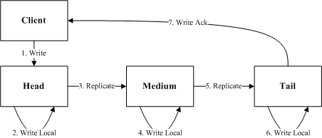
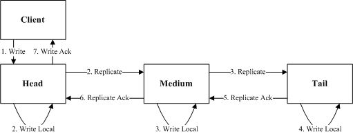
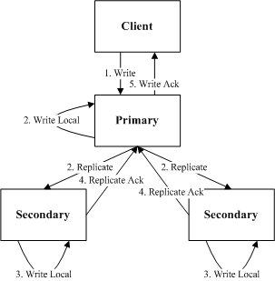
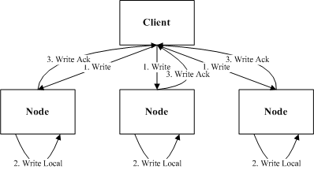

复制模型是分布式系统中一个核心组件，每种复制模型都有自己的优缺点，在设计分布式系统的时候，需要结合业务评估各个业务模型，选择最合适的模型。常见的复制模型包括：链式复制、树形复制、分发复制等。

# 链式复制

链式复制是使用最广泛的复制模型，要将数据复制到全部节点之后，再向client应答成功。链式复制在发展过程中，从基本链式复制发展出了多种改进版本，来改进复制延迟。

## 基本链式复制

最原始的链式复制中，从Client写入开始，要一个节点写入之后再转发给下一个节点。基本链式复制中，Tail节点是最后一个更新，只有读取这个Tail节点才能实现强一致的复制。

整个复制过程的延迟为：

```
rtt1/2 + io1 + rtt2/2 + io2 + rtt3/2 + io3 + rtt4/2
```

基本链式复制中，任意节点如果出现IO慢将会导致复制卡顿。

 



## 改进链式复制

基本链式复制中复制过程需要每个节点依次完成IO才能完成，其中IO的时间占比较多，所以后来出现了很多改进版来优化复制延迟。hdfs中的复制模型就是典型的一种改进链式复制，即每个节点只需要等到下游节点都写入成功，并且本地写入成功之后就可以向上游Ack，由Head节点向Client回复写入成功，读取Head节点实现强一致性复制。

整个复制过程延迟为：

```
rtt1 + Max(io1, rtt2 + Max(io2, rtt3 + io3))
```

虽然改进链式复制改进了延迟，但是依然需要全部节点全部完成写入之后才能向Client应答，任何一个节点IO慢都会造成复制卡顿。



# 树形复制

针对链式复制需要全部节点都要完成写入才能向Client应答，后面业界又发展了一些其他的复制方案，其中树形复制是最典型的一个。Client先向Primary写入，Primary再向Secondary进行转发，Primary写入成功并且至少一个Secondary写入成功就向Client进行Ack。这里面Primary写入本地的时机，有几种不同的实现：Primary先写入本地再向Secondary进行复制；Primary写入本地和向Secondary复制同时进行；Primary先向Secondary复制，其中一个应答之后再写入本地。

我们这里选择延迟最优的Primary写入本地和向Secondary同时复制的方式，其中复制过程延迟为：

```
rtt1 + Max(io1, Min(rtt2 + io2,  rtt3 + io3))
```

树形复制相比链式复制，无需全部节点写入成功，只需要包括Primary节点在内的多数节点写入成功即可，因此只有Primary节点IO慢才会导致复制卡顿。

实际上树形复制还可以优化，当Primary收到两个Secondary写入成功之后就向Client应答，Primary将不再等待未完成的写入，而是直接将更改应用到业务中，这样Client能通过Primary读取到最新的变更。通过这个优化可以解决Primary节点IO慢的复制卡顿问题。



# 分发复制

在上面的复制模型中都或多或少的有慢节点的问题，因此在一些追求复制延迟的场景下，需要一种完全解决慢节点的复制方案，分发复制就是其中的一种。分发复制中节点都是对等的，Client直接向各个节点直接进行分发写入，节点之间并不进行通信复制，只要写入多数节点成功，就判为写入成功。

整个复制流程的延迟为：

```
Median(rtt1 + io1, rtt2 + io2, rtt3 + io3)
```

分发复制很好的解决了慢节点的问题，但是也有很大的局限性，主要面临两个问题：

- 不能同时有两个Writer，多个Writer同时更新就是一个paxos问题。因此一般都是由外部系统来选出一个唯一的Writer，避免多个写入同时发生，保证数据的一致性。
- 另外一个问题就是如何读到最新的数据。因为节点都是对等的，且没有互相通信。Reader只有读取全部节点，根据节点返回的version或者是index之类的才能判断出哪些节点返回的数据是有效的，效率较低；或者是由Writer进行选择上次返回成功的节点进行读取。



# 总结

对上面几种复制模型做一下简单对比，可以根据业务模型做出对应的选择。

- 分发复制只有在单写者的情况下比较有优势，使用范围较为有限。
- 链式复制有较高的吞吐，但延迟较高且无法规避慢节点。
- 树形复制，是吞吐和延迟的一个比较好的折中。

|      | 吞吐         | 延迟   | 慢节点       | 多写   | 实时读取                    |
| ---- | ---------- | ---- | --------- | ---- | ----------------------- |
| 链式复制 | 1 * 网卡带宽   | 高    | 全部节点      | 支持   | Head节点或Tail节点           |
| 树形复制 | 1/2 * 网卡带宽 | 中    | Primary节点 | 支持   | Primary节点               |
| 分发复制 | 1/3 * 网卡带宽 | 低    | 无         | 不支持  | 读取全部节点选择多数，或由Writer节点决定 |