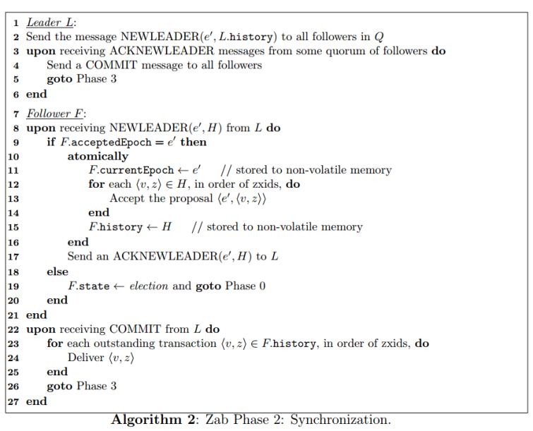
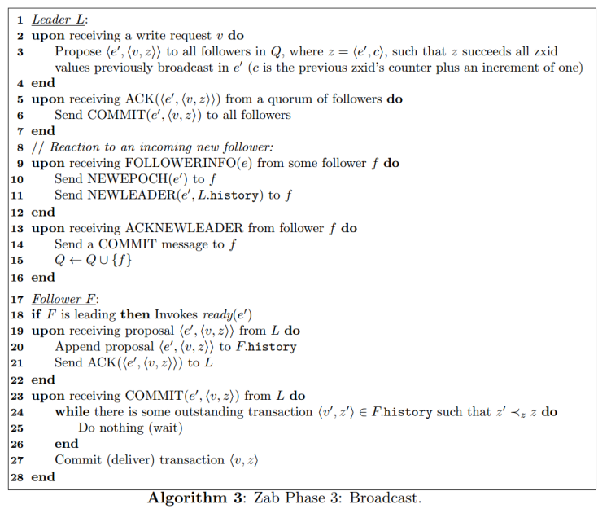
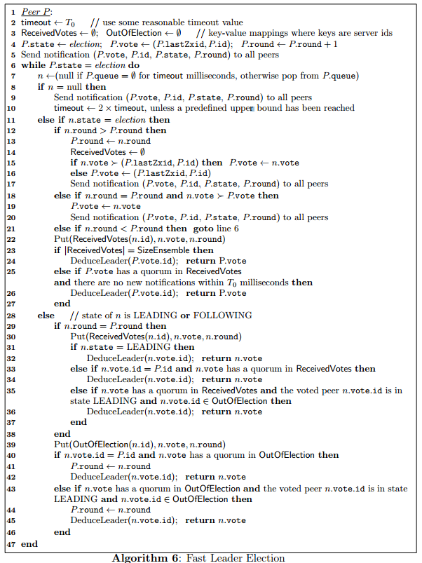
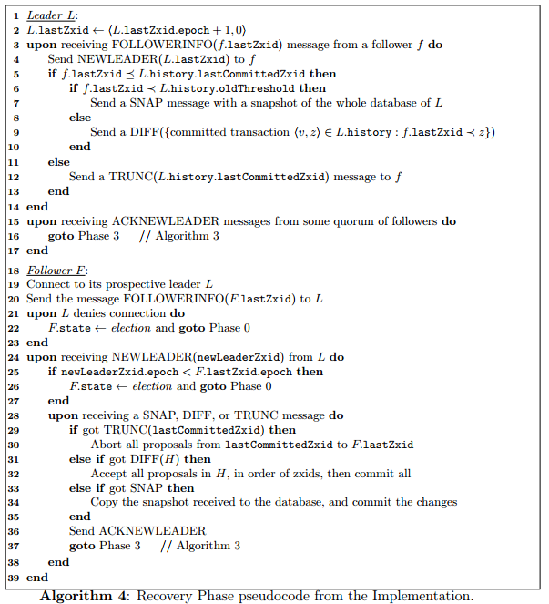
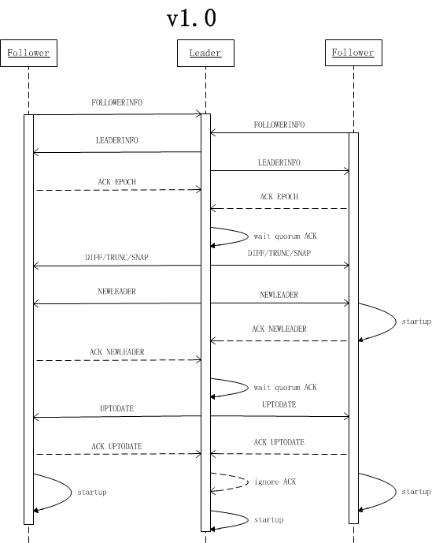

[ZAB](attachments/164310517/252150191.pdf)是Zookeeper Atomic Broadcast协议的简称，是为分布式协调服务Zookeeper专门设计的一种支持崩溃恢复的原子广播协议。其实现类似Raft构建了一个树形主备模式的架构来保持集群中各副本间数据的一致性。采用单一的主进程接受并处理客户端的全部请求，采用ZAB的原子广播协议，将服务状态变更通过proposal的形式广播给其他副本进程。ZAB协议保证了任意时刻一个集群中同时只有一个主进程来广播proposal，所有proposal在副本间保证有序提交。

在ZooKeeper中所有的事务请求都由一个主服务器也就是Leader来处理，其他服务器为Follower，Leader将客户端的事务请求转换为事务Proposal，并且将Proposal分发给集群中其他所有的Follower，然后Leader等待Follwer反馈，当有过半数（>=N/2+1）的Follower反馈信息后，Leader将再次向集群内Follower广播Commit信息，Commit为将之前的Proposal提交。

# ZAB协议简介

## 状态

ZAB协议中每个进程有三种状态：

- **Looking**：系统刚启动时或者Leader崩溃后正处于选举状态
- **Following**：Follower节点所处的状态，Follower与Leader处于数据同步阶段
- **Leading**：Leader所处状态，当前集群中有一个Leader为主进程

ZooKeeper启动时所有节点初始状态为Looking，这时集群会尝试选举出一个Leader节点，选举出的Leader节点切换为Leading状态；当节点发现集群中已经选举出Leader则该节点会切换到Following状态，然后和Leader节点保持同步；当Follower节点与Leader失去联系时Follower节点则会切换到Looking状态，开始新一轮选举；在ZooKeeper的整个生命周期中每个节点都会在Looking、Following、Leading状态间不断转换。

## 持久化数据

- **history**：当前节点接收到事务提议的 log
- **acceptedEpoch**：follower 已经接受的 leader 更改epoch的 NEWEPOCH 提议
- **currentEpoch**：当前所处的epoch
- **lastZxid**：history 中最近接收到的提议的 zxid （最大的）

> 在 ZAB 协议的事务编号 Zxid 设计中，Zxid 是一个 64 位的数字，其中低 32 位是一个简单的单调递增的计数器，针对客户端每一个事务请求，计数器加 1；而高 32 位则代表 Leader 周期 epoch 的编号，每个当选产生一个新的 Leader 服务器，就会从这个 Leader 服务器上取出其本地日志中最大事务的ZXID，并从中读取 epoch 值，然后加 1，以此作为新的 epoch，并将低 32 位从 0 开始计数。
>
> epoch：类似Raft中的term，标明leader的版本，每次leader变更都会进行提升，这样可以用于fence之前老的leader崩溃恢复之后重新加入。

## 协议流程

ZAB协议主要包括消息广播和崩溃恢复两个过程，进一步可以细分为发现（discovery）、同步（sync）和广播(Broadcast)阶段，组成ZAB协议的每一个分布式进程会循环执行这三个阶段。每个节点启动之后进入discovery阶段，其实就是一次选主过程，如果选主成功则进入Leader状态，否则可能会发现当前Leader加入集群。一旦节点出现异常，将会进入discovery阶段。

### 消息

上面是ZAB协议的三个核心工作流程，整个过程中各进程间交互的消息说明如下：

- CEPOCH：Follower进程向准Leader发送自己处理过的最后一个事务Proposal的epoch值
- NEWEPOCH：准Leader进程根据接收的各进程的epoch，来生成一个新一轮周期的epoch值
- ACK-E：Follower进程反馈准Leader进程发来的NEWEPOCH消息
- NEWLEADER：准Leader进程确定自己的领导地位，并发送NEWLEADER消息给各进程
- ACK-LD：Follower进程反馈Leader进程发来的NEWLEADER消息
- COMMIT-LD：要求Follower进程提交相应的历史Proposal
- PROPOSAL：Leader进程生成一个针对客户端事务请求的Proposal
- ACK：Follower进程反馈Leader进程发来的PROPOSAL消息
- COMMIT：Leader发送COMMIT消息，要求所有进程提交事务PROPOSE

### Phase 0: Leader election

节点在一开始都处于选举阶段，只要有一个节点得到超半数节点的票数，它就可以当选准 leader。只有到达 Phase 3 准 leader 才会成为真正的 leader。这一阶段的目的是就是为了选出一个准 leader，然后进入下一个阶段。

协议并没有规定详细的选举算法，后面我们会提到实现中使用的 Fast Leader Election。

### Phase 1: Discovery

这个阶段主要就是Leader是选举过程，用于在多个分布式进程中选举出一个准Leader进程。这个时候准leader不一定能够选主成功，任何一个节点故障之后都会触发选主流程加入集群。

zab的实现不是基于RPC的，而是面向socket的方式。选举开始后节点会建立与其他节点的连接，并发送自己的epoch和lastZxid，其他节点回复currentEpoch(cepoch)。准Leader收集Follower的cepoch，并根据max(cepoch)+1生成newEpoch，再通知给其他节点更新其acceptEpoch。newEpoch通知过程中，Follower会反馈其历史事务proposal集合。这样准Leader就可以判断出当前集群中多数节点中哪个节点拥有最新的数据。

### Phase 2: Synchronization

同步阶段主要是利用 leader 前一阶段获得的最新提议历史，同步集群中所有的副本。准Leader先与Discovery阶段发现的各个Follower节点的历史proposal集合，判断出最新数据节点，然后与其进行同步。

当准Leader同步完成最新数据之后，再通过NewLeader向其他节点通知其当选为新的Leader，并向其同步数据。只有当 quorum 都同步完成，准 leader 才会成为真正的 leader。follower 只会接收 zxid 比自己的 lastZxid 大的提议。

**这里只有当准Leader将多数节点数据同步到一致状态之后，才会发送NewLeader给多数节点，多数节点才更新其本地的currentEpoch。这与raft中term节点自行增加的方式不同。**

### Phase 3: Broadcast

到了这个阶段， leader才能对外提供服务，可以进行消息广播。数据同步的过程类似一个2PC，Leader将client发过来的请求生成一个事务proposal，然后发送给Follower，多数Follower应答之后，Leader再发送Commit给全部的Follower让其进行提交。

具体算法描述如下：e'为新的epoch，Q为quorum集合，f为follower。

# 协议实现

协议的 Java 版本实现跟上面的定义有些不同，选举阶段使用的是 Fast Leader Election（FLE），它包含了 Phase 1 的发现职责。因为 FLE 会选举拥有最新提议历史的节点作为 leader，这样就省去了发现最新提议的步骤。实际的实现将 Phase 1 和 Phase 2 合并为 Recovery Phase（恢复阶段）。所以，ZAB 的实现只有三个阶段：

- Fast Leader Election
- Recovery Phase
- Broadcast Phase

## Fast Leader Election

FastLeaderElection是标准的Fast Paxos的实现，它首先向所有Server提议自己要成为leader，当其它Server收到提议以后，解决 epoch 和 zxid 的冲突，并接受对方的提议，然后向对方发送接受提议完成的消息。FastLeaderElection算法通过异步的通信方式来收集其它节点的选票，同时在分析选票时又根据投票者的当前状态来作不同的处理，以加快Leader的选举进程。FLE 会选举拥有最新提议历史（lastZxid最大）的节点作为 leader，这样就省去了发现最新提议的步骤。这是基于拥有最新提议的节点也有最新提交记录的前提。

**成为 leader 的条件**

- 选epoch最大的
- epoch相等，选 zxid 最大的
- epoch和zxid都相等，选择server id最大的（就是我们配置zoo.cfg中的myid）

节点在选举开始都默认投票给自己，当接收其他节点的选票时，会根据上面的条件更改自己的选票并重新发送选票给其他节点，当有一个节点的得票超过半数，该节点会设置自己的状态为 leading，其他节点会设置自己的状态为 following。

### 数据恢复阶段

每个ZooKeeper Server读取当前磁盘的数据（transaction log），获取最大的zxid。

### 发送选票

每个参与投票的ZooKeeper Server向其他Server发送自己所推荐的Leader，这个协议中包括几部分数据：

- 所推举的Leader id。在初始阶段，第一次投票所有Server都推举自己为Leader。
- 所推举节点上最大zxid值。这个值越大，说明该Server的数据越新。
- logicalclock。这个值从0开始递增，每次选举对应一个值，即在同一次选举中，这个值是一致的。这个值越大说明选举进程越新。
- 本机的所处状态。包括LOOKING，FOLLOWING，OBSERVING，LEADING。

### 处理选票

每台Server将自己的数据发送给其他Server之后，同样也要接受其他Server的选票，并做一下处理。

**如果Sender的状态是LOOKING**

- 如果发送过来的logicalclock大于目前的logicalclock。说明这是更新的一次选举，需要更新本机的logicalclock，同时清空已经收集到的选票，因为这些数据已经不再有效。然后判断是否需要更新自己的选举情况。首先判断zxid，zxid大者胜出；如果相同比较leader id，大者胜出。
- 如果发送过来的logicalclock小于于目前的logicalclock。说明对方处于一个比较早的选举进程，只需要将本机的数据发送过去即可。
- 如果发送过来的logicalclock等于目前的logicalclock。根据收到的zxid和leader id更新选票，然后广播出去。

当Server处理完选票后，可能需要对Server的状态进行更新：

- 判断服务器是否已经收集到所有的服务器的选举状态。如果是根据选举结果设置自己的角色（FOLLOWING or LEADER），然后退出选举。
- 如果没有收到没有所有服务器的选举状态，也可以判断一下根据以上过程之后更新的选举Leader是不是得到了超过半数以上服务器的支持。如果是，那么尝试在200ms内接收下数据，如果没有心数据到来说明大家已经认同这个结果。这时，设置角色然后退出选举。

**如果Sender的状态是FOLLOWING或者LEADER**

- 如果LogicalClock相同，将数据保存到recvset，如果Sender宣称自己是Leader，那么判断是不是半数以上的服务器都选举它，如果是设置角色并退出选举。
- 否则，这是一条与当前LogicalClock不符合的消息，说明在另一个选举过程中已经有了选举结果，于是将该选举结果加入到OutOfElection集合中，根据OutOfElection来判断是否可以结束选举，如果可以也是保存LogicalClock，更新角色，退出选举。

## Recovery Phase

这一阶段 follower 发送它们的 lastZixd 给 leader，leader 根据 lastZixd 决定如何同步数据。这里的实现跟前面 Phase 2 有所不同：Follower 收到 TRUNC 指令会中止 L.lastCommittedZxid 之后的提议，收到 DIFF 指令会接收新的提议。

ZAB中Leader会根据Follower数据情况使用多种同步策略：

- SNAP：如果Follower数据太老，Leader将发送快照SNAP指令给Follower同步数据
- DIFF：Leader发送从Follower.lastZxid到Leader.lastZxid之间的提案DIFF数据给Follower同步数据
- TRUNC：当Follower.lastZxid比Leader.lastZxid大时，Leader发送从Leader.lastZxid到Follower.lastZxid的TRUNC指令让Follower丢弃该段数据

SNAP和DIFF用于保证集群中Follower节点上已经Committed的数据的一致性，TRUNC用于抛弃已经被处理但是还没有Committed的数据。Follower接收SNAP/DIFF/TRUNC指令同步数据与ZXID，同步成功之后向Leader发送ACK-LD，Leader才会将其加入到可用Follower列表。

具体消息流程如下：

