# RAFT Introduction

At present, there are many distributed consistent replication protocols in the industry, such as Paxos, Zab, Viewstamped Replication, etc. Among them, the Paxos proposed by Lamport is considered to be the foundation of the distributed consistent replication protocol, and other consistent replication protocols are variants of it. However, the Paxos paper only gives the process of a single proposal, and does not give a detailed description of the MultiPaxos needed in the replication state machine. The Zab protocol is used in Zookeeper and is widely used in the industry, but it is not abstracted into a general library. Although Viewstamped Replication came out relatively early, it has not become popular, and there are few implementations. Based on these types of distributed consistent replication protocols, a distributed system that satisfies CP (strong consistency and partition tolerance) can be constructed, and the availability will be discounted because it guarantees the survival of most copies and the inability to read and write during the master election.
RAFT is a distributed consistent replication protocol proposed in the RamCloud project of Stanford University. It is known for its ease of understanding. Since its launch, many RAFT implementations have emerged in the industry, including etcd of CoreOS. Compared with Zab and Viewstamped Replication, RAFT simplifies the status and interaction in the protocol, making it clearer and easier to understand and easier to implement. The following table shows the comparison of Multi-Paxos, RAFT, Zab and ViewStamped Replication:

| | **Multi-Paxos** | **RAFT** | **Zab** | **Viewstamped Replication** |
| --- | --- | --- |---------|-----------------------------|
| Leader Election | Yes | Yes | Yes     | Yes                         |
| Log Replication | Yes | Yes | Yes     | Yes                         |
| Log Recovery | Yes? | Yes | Yes     | Yes                         |
| Log Compaction | Yes? | Yes | Yes     | Yes                         |
| Membership Management | Yes? | Yes | No      | Yes                         |
| Understandable | Hard | Easy | Medium  | Medium                      |
| Protocol Details | No | Yes | Yes     | Yes                         |
| Implements | Few | Mass | Many    | Few                         |

In RAFT, the node status is divided into:

- Leader: Receive client requests and copy them. There is only one Leader at any time
- Follower: passively receive various RPC requests
- Candidate: used to elect a new leader

In RAFT, the follower will switch to the Candidate state if it does not receive the heartbeat for a long time. After receiving the majority vote response, it can be converted to the Leader, and the Leader will periodically send heartbeats to other nodes. When Leader and Candidate receive a higher version of the message, they turn to Follower. The specific node state transition diagram is as follows:
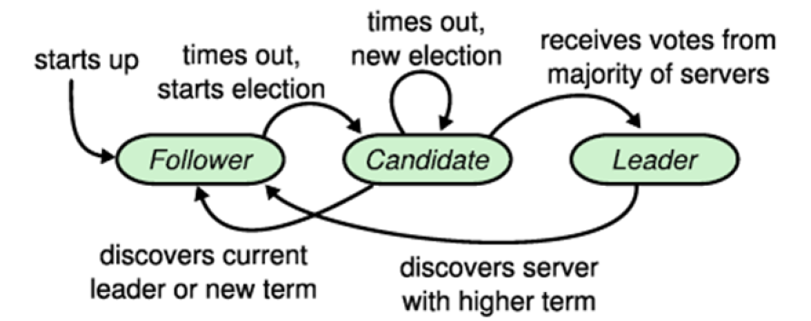
RAFT relatively elegantly solves several problems in the above replication state machine. The following is a detailed description of the master selection, repair, and node changes.

## Leader Election

In RAFT, the time is divided into Term, used for election, to mark the Normal Case under a certain Leader. Each Term has at most one Leader. Some terms may fail to elect the leader without the Leader (time out without reaching the majority vote response).
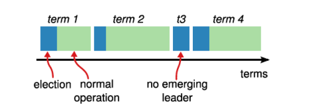
In the process of RAFT master selection, each Candidate node first adds one to the local Current Term, and then sends a RequestVote request to other nodes. Other nodes judge whether the response is successful or not based on the local data version, length and the result of previous master selection. The specific processing rules are as follows:

1. If now – lastLeaderUpdateTimestamp <elect_timeout, ignore the request
2. If req.term <currentTerm, ignore the request.
3. If req.term> currentTerm, set req.term to currentTerm, if it is Leader and Candidate, switch to Follower.
4. If req.term == currentTerm, and the local voteFor record is empty or consistent with the term and CandidateId in the vote request, req.lastLogIndex> lastLogIndex, that is, if the Candidate data is newer to the local, the main selection request is agreed.
5. If req.term == currentTerm, and if the local voteFor record is not empty and is consistent with the term CandidateId in the vote request, the CandidateId is inconsistent, then the main selection request is rejected.
6. If lastLogTerm> req.lastLogTerm, the term of the last local log is greater than the lastLogTerm in the request, indicating that the data on the candidate is older than the local one, and the host selection request is rejected.

The above selection of the main request is in line with Paxos's principle of "the minority obeys the majority, and the latter agrees with the former". According to the above rules, the elected Leader must be the node with the latest Log data among most nodes. Let's analyze the time and livelock problem of the leader selection. Set Follower to detect the Leader Lease timeout as HeartbeatTimeout. The time interval for the leader to periodically send heartbeats will be less than HeartbeatTimeout to avoid Leader Lease timeout, usually set to less than HeartbeatTimeout/2. When there is a conflict in the election, that is, there are two or more nodes electing the master at the same time, and no response from the majority of the nodes is obtained, the election needs to be re-elected. This is a common master election livelock problem. The random timeout mechanism is introduced in RAFT to effectively avoid the livelock problem.

Note that the comparison between the old and new Log above is based on lastLogTerm and lastLogIndex, not based on currentTerm and lastLogIndex. currentTerm is only used to ignore the vote request of the old Term, or to improve its currentTerm, and does not participate in the decision of the old and new Log. Consider a node with an asymmetric network partition. In a period of time, it will continue to vote and increase currentTerm. This will cause the network to recover. After the leader receives the term in AppendEntriesResponse that is larger than currentTerm, the leader will reset currentTerm and proceed. StepDown, so that the leader aligns its own Term to the term of the division node, restarts the election of the leader, and finally will elect a leader with term>= the division node Term in the last majority set.

### Symmetric network partitioning

The treatment of symmetric network division in the original RAFT paper is that after a node goes online again, the Leader receives a RequestVote request higher than currentTerm and performs StepDown. In this way, even if the node has been deleted through RemovePeer, the current Lease will still be interrupted, causing the replication group to be unavailable. For this case, special treatment can be done: Leader does not receive RequestVote requests, the specific conditions are as follows:

- For nodes belonging to PeerSet, Leader will StepDown because it encounters a higher term in AppendEntries that are retried
- For nodes that do not belong to the PeerSet, Leader will always ignore

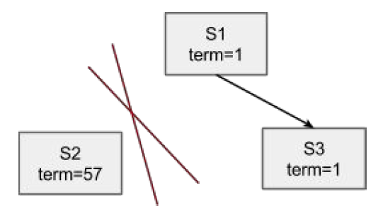

In this way, the nodes that belong to the PeerSet can eventually join, and the nodes that do not belong to the PeerSet will not join and will not be destroyed. If the network partition is caused by a node failure, the stable majority of the replication groups will not receive a higher term AppendEntries response, and the leader will not StepDown, so that the node can join the cluster quietly.

### Asymmetric network partitioning

The original RAFT paper did not handle asymmetric network divisions well. For example, S1, S2, and S3 are located in three IDCs respectively. Among them, the network between S1 and S2 is not connected, and the others can be connected. In this way, once S1 or S2 grabs the leader, the other party will trigger the leader selection after the timeout. For example, S1 is the leader, S2 continues to timeout to trigger the leader selection, and S3 promotes Term to interrupt the current lead, thereby rejecting the leader's update. At this time, a trick check can be added. Each follower maintains a timestamp to record the time when the data update on the leader is received. Vote requests are only allowed to be accepted after the ElectionTImeout is exceeded. In this similar Zookeeper, only Candidate can initiate and accept votes, which can ensure that S1 and S3 can always maintain a stable quorum set, and S2 cannot successfully elect the master.

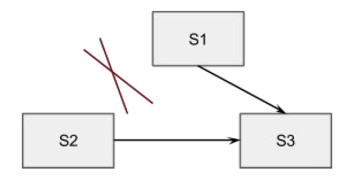

### StepDown

In the original RAFT protocol, the Leader will perform StepDown when it receives any request with a term higher than currentTerm. In actual development, StepDown should be performed at the following moments:

- Leader receives a failure response from AppendEntries, Term is greater than currentTerm
- Leader did not write the majority of successes in ElectionTimeout, which is achieved through logic clock check (there will be 10 HeartBeats in 1 ElectionTimeout)
- Leader is not in the node list when the LogEntry of RemovePeer is Commited, StepDown is performed, and Shutdown is usually performed

## Log Replication

Once a leader is elected, it becomes responsible for serving client requests. Each client request contains an instruction to be executed by the replicated state machine. The leader first appends this instruction to the log to form a new entry, and then sends the entry to other servers in parallel through AppendEntries RPCs. If other servers find no problems, they will give the leader an ACK indicating success after successful replication. Leader After receiving most ACKs, the log is applied and the execution result of the client is returned. If followers crash or lose packets, the leader will keep retrying AppendEntries RPC. Logs are organized according to the following figure:

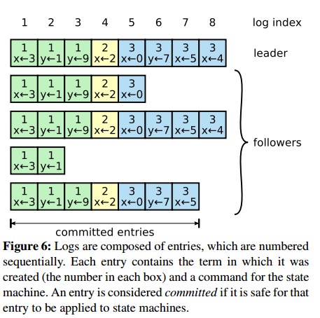

Each log entry stores an instruction for the state machine and also stores the term number when the entry is received from the leader. The term number can be used to determine the inconsistency between some logs. Each entry also has an index indicating its position in the log.

The leader needs to decide when it is safe to apply the log to the state machine, and the entry that can be applied is called committed. RAFT guarantees the persistence of committed entries and is ultimately used by other state machines. Once a log entry is replicated to most nodes, it becomes committed. At the same time, we should pay attention to a situation. If there are uncommitted entries before the current entry to be submitted, even if it is created by an outdated leader, as long as it has been stored on most nodes, it will be submitted in order at one time. The leader should track the latest committed index, and piggyback every AppendEntries RPCs (including heartbeats) so that other servers know that a log entry has been submitted, so that it can be applied to their local state machine. The specific state transition diagram of Log Entry is as follows:
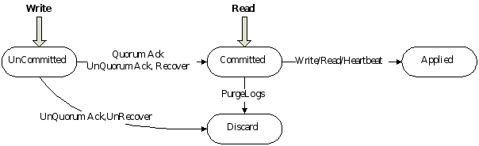

After each node restarts, first load the previous snapshot, then join the RAFT replication group, choose the master or receive updates. Because the data in the Snapshot must be Applied, it must be Committed, and the loading is safe. However, the data in the Log is not necessarily Committed, because we did not persist the CommittedIndex, so we are not sure whether the Log is Committed and cannot be loaded. Although loading the snapshot first delays the time for a new node to join the cluster, it can ensure that once a node becomes a leader, it can load complete data and provide services relatively quickly. In the same way, after Follower receives InstallSnapshot, it will reply to Leader after receiving and loading the Snapshot.

### Log Recovery

Log Recovery is divided into current Term repair and prev Term repair. Log Recovery is to ensure that the committed data will not be lost, and the uncommitted data will be converted to Committed, but it will not affect the consistency between nodes due to the interruption and restart of the repair process. sex.

The current Term repair is mainly to solve some follower nodes restarting to join the cluster, or adding a new follower node to join the cluster, the Leader needs to transmit the missing Log Entry to the Follower node, if the Log Entry required by the Follower has been cleared on the Leader Log Compaction , Leader needs to transmit the previous Snapshot and subsequent Log Entry to the Follower node. In the Leader-Alive mode, as long as the Leader copies a Log Entry to most nodes, the Log Entry will be converted to Committed.
The prev Term repair is mainly to ensure the consistency of the data before and after the Leader switch. From the above RAFT election, we can see that the leader elected each time must contain the committed data (the drawer principle, the elected leader is the most recent data in the majority, and must include the data that has been committed on the majority of nodes), new The leader will overwrite inconsistent data on other nodes. Although the newly elected leader must include the Log Entry that the leader of the previous term has committed, it may also include the Log Entry that the leader of the previous term has not committed. This part of Log Entry needs to be converted to Committed, which is relatively troublesome. It is necessary to consider that the Leader has switched multiple times and the Log Recovery has not been completed. It is necessary to ensure that the final proposal is consistent and determined.
A constraint is added to RAFT: For the uncommitted data of the previous term, repair to most nodes, and at least one new Log Entry under the new term is copied or repaired to the majority of nodes, before the uncommitted Log Entry can be considered Turn to Committed. The following figure is a process of prev Term Recovery:
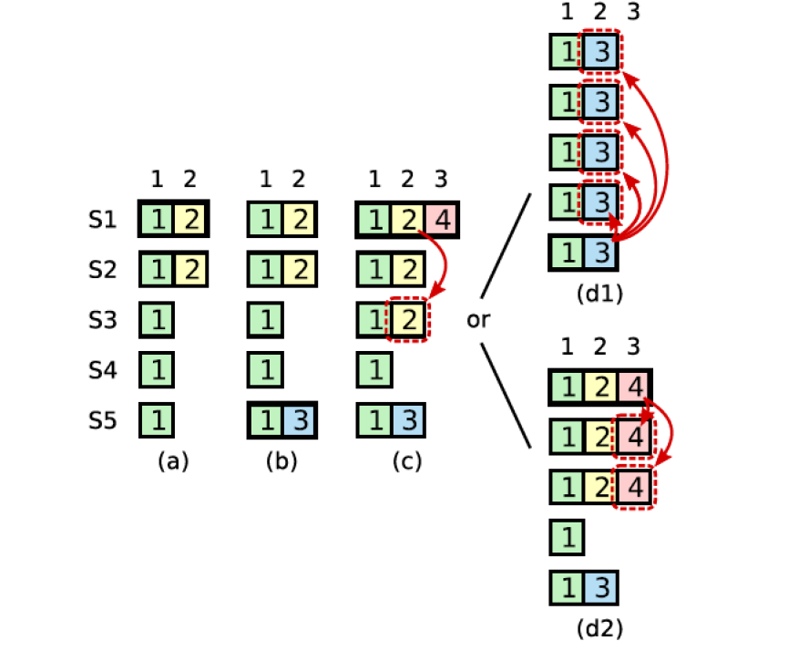

1. S1 is the leader of Term2, copy the LogEntry part to position 2 of S1 and S2, and then Crash.
2. S5 is selected as the leader of Term3 by S3, S4 and S5, and only one LogEntry is written to the local, and then Crash.
3. S1 is selected as the leader of Term4 by S1, S2 and S3, and the data at position 2 is restored to S3 to reach the majority; and a Log Entry is written locally, and then Crash.
4. Although the Log Entry at position 2 has been copied to most nodes at this time, it is not Committed.
    1. S5 is selected as the leader of Term5 by S3, S4 and S5, and copy the data written by Term3 at local No. 2 position to other nodes, overwriting the data written by Term2 on S1, S2, and S3
    2. S1 is selected as the leader of Term5 by S1, S2, and S3, and the data written in Term4 at position 3 is copied to S2 and S3, so that the data written in Term2 at position 2 becomes Committed

It can be seen from the above process that in the case of prev Term Recovery, as long as the Log Entry has not been Committed, even if it is repaired to most nodes, it may still not be Committed, and it must rely on the new Term to have a new Log Entry to be After being copied or repaired to the majority of nodes, it can be considered Committed.
After the leader is selected, the copy will be repaired during the running of the leader. At this time, as long as most of the copy data is complete, it can work normally. Leader maintains a nextId for each follower, marking the next logIndex to be sent. After the Follower receives AppendEntries, it will perform some consistency checks to check whether the LastLogIndex specified in AppendEntries is consistent. If it is inconsistent, it will return a failure to the Leader. After the leader receives the failure, it will decrement the nextId by 1, and send it again until it succeeds. This backtracking process is actually to find the last CommittedId on the Follower, and then the Leader sends the subsequent LogEntry. Because Follower's persistent CommittedId will increase the update delay, the backtracking window is only the inconsistent LogEntry between replicas caused by Leader switching, and the amount of data in this part is generally very small.


In the above figure, the data of Follower a and Leader are the same, but there are missing data, which can be optimized to directly notify Leader to start retransmission from logIndex=5, so that only one backtracking is required. Follower b and Leader have inconsistent data, and need to go back 7 times to find the location that needs to be retransmitted.

After reselecting the leader, the new leader does not have the nextId maintained in the previous memory, and uses the local lastLogIndex+1 as the nextId of each node. In this way, the nextId can be adjusted according to the node's AppendEntries response:

**nextIndex**

```cpp
local.nextIndex = max(min(local.nextIndex-1, resp.LastLogIndex+1), 1)
```

## Log Compaction

The update is written to the Log through the Leader, copied to most nodes, becomes Committed, and then submitted to the business state machine. In the actual system, when this process runs for a long time, the Log will grow indefinitely, causing the Log to take up too much disk space and require a longer startup time to load. If you do not take some measures for Log Compaction, the system will eventually become unusable.

Snapshot is a common method of Log Compaction. It writes all the state of the system into a Snapshot and persists it in a reliable storage system. After the Snapshot is completed, the log before this point can be deleted.

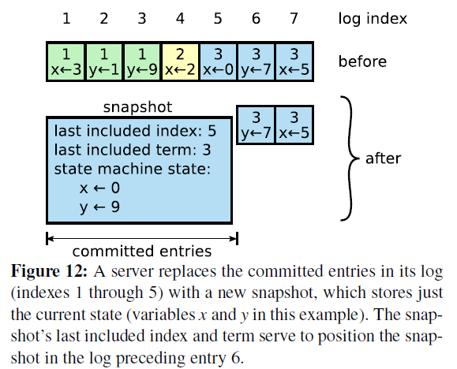

In Snapshot, in addition to the business state machine dumping its own business data, some meta-information is also required:

- last included index: the index of the log entry last applied when the snapshot was taken
- last included term: the term of the log entry that was applied last when the snapshot was taken
- last included configuration: the last configuration when making the snapshot

Because after the snapshot is completed, the last include index and its previous Log will be deleted, so that another restart needs to restore information such as term, index, and cofiguration, considering the situation that the snapshot is not written and restarted.

The timing of the snapshot also has an impact on the system. If snapshots are too frequent, a lot of disk bandwidth will be wasted; if Snasphot is too infrequent, then Log will take up a lot of disk space and the startup speed will be slow. A simple way is to take a snapshot when the Log reaches a certain size, or take a snapshot after a certain time. This is judged based on the business scenario. If the log loading speed is fast, you can use the quantitative snapshot method, and the quantitative size can be much larger than the snapshot size; if the log loading speed is very slow, you can use the periodic snapshot method to avoid the log being too long .

Snapshot will take a relatively long time. If you expect that Snapshot will not affect normal Log Entry synchronization, you need to use Copy-On-Write technology to achieve. For example, the underlying data structure or storage support COW, LSM-Tree type data structure and KV library generally support Snapshot; or use the system's COW support, Linux fork, or ZFS Snapshot, etc.

### InstallSnapshot

Under normal circumstances, Leader and Follower do Snapshots independently, but when the Log gap between Leader and Follower is large, Leader has completed a Snapshot, but Follower still has not finished synchronizing the Log in the Snapshot. At this time, you need the Leader to send a snapshot. Follower sends Snapshot.

The processing flow after the Follower receives the InstallSnapshot request is as follows:

1. Check req.term <currentTerm and return directly to failure
2. Create a Snapshot and accept subsequent data
3. Save the Snapshot meta-information, and delete the previously completed or incomplete Snapshot
4. If the existing LogEntry is consistent with the last_included_index and last_include_term of the snapshot, keep the subsequent log; otherwise delete all the logs
5. Follower reloads the snapshot

Since the InstallSnapshot request may also be retransmitted, or a leader switch occurs during the InstallSnapshot process, the last_included_index of the new leader is relatively small, and there may be an UnCommitted LogEntry. At this time, InstallSnapshot is not required. Therefore, when Follower receives InstallSnapshot, Follower does not directly delete all Logs, but deletes the last_include_index of Snapshot and the previous Log Entry, and the subsequent Log Entry of last_include_index continues to be retained. If you need to keep the later Log Entry, you don't actually need to load the Snapshot at this time. If you delete all of them, you need to reload the Snapshot to restore it to the latest state.

Since Snapshot may be relatively large, RPC has a message size limit, and some methods need to be used for processing: data can be split using N RPCs, each with offset and data; it can also be Chunk, using one RPC, but split into multiple Chunks for sending.

## Membership Management

During the operation of a distributed system, there will always be fault reports on nodes for repair, and it is necessary to support the dynamic addition and deletion of nodes. The process of adding and deleting nodes cannot affect the replication of the current data, and can automatically repair the data of the new node. If the deletion of the node involves the leader, the automatic leader selection needs to be triggered. Directly adding nodes may result in the combination of new and old nodes appearing in two majority sets, causing conflicts. The following figure shows the expansion of a 3-node cluster to a 5-node cluster. Direct expansion may cause Server1 and Server2 to form an old majority set, and Server3, Server4 and Server5 form a new majority set. The two do not intersect, which may lead to conflicts of resolutions. .
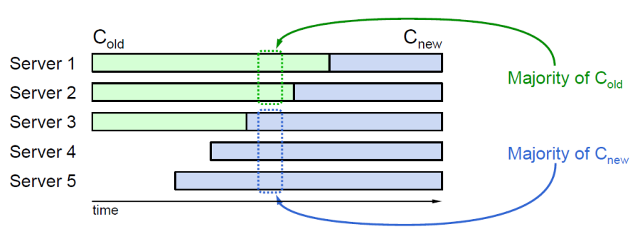

### Joint-Consensus

RAFT uses a collaborative and consistent approach to resolve node changes. First submit a Configuration command that includes the combination of the new and old nodes. After this message Commit, submit a Configuration command that only includes the new node. Any node in the new and old collections can become the leader, so after the leader goes down, if the new leader does not see the Configuration log including the new and old node collection (this configuration log is not written in the old node collection), continue Form a replication group with a set of old nodes (nodes in the old node set that receive the configuration log will truncate the log); if the new leader sees the Configuration log that includes the set of new and old nodes, the unfinished node change process will be completed. The specific process is as follows:

1. First perform CaughtUp tracking data on the new node
2. After all new nodes have completed CaughtUp, send the Cold+new command to the old and new collections
3. If the majority of the new node set and the majority of the old node set respond to Cold+new, send the Cnew command to the new and old node set
4. If the majority of the new node set responds to Cnew, the node switch is completed

The schematic diagram of configuration changes is as follows:

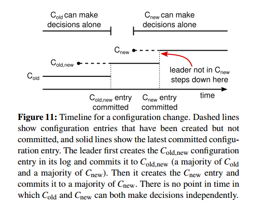

The following is the state transition diagram during the node change process:

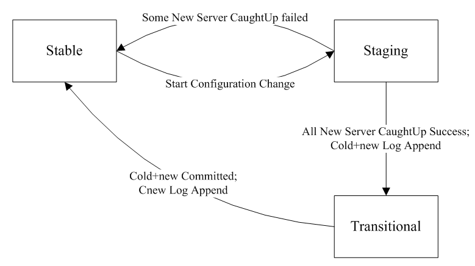


The following rules need to be met during node configuration changes:

- Any node in the old and new collections may become the leader
- Any resolution needs to be passed by a majority of the old and new sets

Combining the above process and state transition diagram, if Cold+new is committed to a majority of the old and new collections, even if the process is terminated, the new leader can still see Cold+new, and continue to complete the Cnew process, and finally complete the node change; if If Cold+new is not submitted to the majority of the old and new collections, the new leader may or may not see Cold+new. If you see it, you can still complete the Cnew process. If you don’t see it, it means that Cold+new is in two collections. I didn't get a majority of responses, so I followed Cold to perform the cluster operation again. Here is an explanation of the master selection process. In the two-stage process, the selection of the master requires both the old and the new set to reach a majority agreement.

### Single-Server Change

In fact, the above process can be simplified. Only one node is added or deleted at a time, so that there will be no two majority sets, and no conflict of resolutions will be caused. Process according to the following rules:

1. Leader processes when it receives AddPeer/RemovePeer, instead of waiting until committed, so that the new peer set can be used to copy AddPeer/RemovePeer requests immediately.
2. When the Leader starts, it sends a NO_OP request to change the previous AddPeer/RemovePeer to committed, and invalidate the AddPeer/RemovePeer that has not been copied to the current Leader. Until the NO_OP request is committed, you can safely create a new configuration and start copying it.
3. When the Leader deletes its own node, it will shut down after the RemovePeer is Committed.

According to the above rules, secure dynamic node additions and deletions can be achieved, because node dynamic adjustment and Leader election are two parallel processes, and nodes need some loose checks to ensure the majority set of election and AppendEntries:

1. The node can accept AppendEntries requests that are not from its own leader
2. Nodes can vote for Candidates that do not belong to their node list

There are several problems with single node changes:

1. Whether the old node set or the new node set is used as the node set for the Configuration Change log
2. When to modify the node set in local memory

No matter whether Configuration Change is based on the new node set or the old node set, it will not destroy "the majority of the new and old node sets have at least one node intersecting".

1. The problem based on the old node set is that for a two-node cluster, add_peer or remove_peer cannot be performed after one is down. In fact, it can be generalized to half of the even-numbered node failure, and add_peer/remove_peer based on the old node set cannot be completed. Based on the old node set, the NO_OP log when the leader starts can be omitted, and the deleted node can also receive remove_peer and automatically shut down. The leader goes down during the process of synchronizing the Configuration Change log, and the old node re-selects a leader in a centralized manner, and either restores to the old configuration or continues with the new configuration change.
2. Based on the fact that the logs of the new node set before the Configuration Change log are all Committed, it can solve the case of half of the even-numbered nodes above, but it is of little practical significance. Based on the new node set, a NO_OP log needs to be written when the leader starts. The leader goes down during the process of synchronizing the Configuration Change log, and a leader is re-elected from the merge (old node set, new node set), and either restores to the old configuration or continues with the new configuration change.

Regarding when to modify the local node set, you only need to ensure that the Committed Log will not be overwritten under Configuration Change, and whether the Log after Configuration Change adopts the new set or the old set will not break this rule.

The RAFT author's paper uses a new node set and writes down the Configuration Change Log locally to modify the memory Configuration solution. In etcd, the old node set is used and the memory configuration is modified after the majority of the old node sets are committed.

When deleting a node in an even-numbered node cluster, the counting replica of the log before remove_peer is more than that of the subsequent logs, and the subsequent logs may satisfy counting first. If the following log becomes committed, the previous log is also committed, because the majority of the node set of the old configuration will not be selected as the leader, so no overwriting will occur. Hashicorp's implementation is to commit commits strictly in order, that is, only the previous logs can become committed after all the counting is satisfied.

When most nodes fail, the leader should step down, set the same node set to each node in the new node set through set_peer, trigger them to re-elect the leader, and the new leader writes an add_peer log (the node set set by set_peer Synchronization shall prevail).

In addition, when the leader starts, it is very important to send an AddPeer or NOP request first: if the number of clusters is an even number, and the last leader fails to commit to the majority when the node is changed; the new leader changes it if it starts The node set may be judged to be Committed according to the new node set, but after the old leader is started, another majority set is formed according to the new node set, and the change log of the node that has not been committed before becomes Committed, which may cause a split brain. Cause data loss. After the new leader is started, a data non-node change log must be committed before node changes can be initiated. This committed non-node change log can ensure that there is at least one node intersection with the previous UnCommitted log, so that UnCommitted node changes can be guaranteed The log will no longer become Committed. For detailed discussion, please refer to: <https://groups.google.com/forum/#!topic/RAFT-dev/t4xj6dJTP6E>

### Configuration Store

After the node restarts, the Configuration must be consistent with the Configuration before the node hangs, which means that the Configuration is consistent with the Log. If you find a separate place to store the Configuration, you need to ensure that the storage of the Configuration and the log are atomic and reentrant. Configuration storage occurs when the Configuration Change log is written. For Leader, it needs storage to start asynchronous writing, and for Follower, storage is required for successful writing. In principle, the LogEntry that has not been Committed before Configuration Change only needs a majority response from the Old node set. In practice, it can be restricted to both the Old node set and the New node set to respond with the majority, which can simplify the management of the Configuration.

The Configuration saved in the Snapshot must be Applied, and must be Committed. However, the Configuration in the Log may be UnCommitted because the CommittedIndex is not recorded. Before starting, you need to scan the Log to get the Configuration in it, here is not just getting the last Configuration. Because the last Configuration Change Log may be UnCommitted and thus overwrite, you need to find the last Configuration, so you need to get all the Configurations in the Log. After completing the master selection, use the last Configuration as the node list configuration. By periodically persisting all Configurations, the scanning speed before startup can be accelerated, and only the logs after the last Configuration recorded are scanned.

## Safety

Some of the processing procedures of RAFT have been described above, but the security assurance of RAFT has not been described too much. For example, a follower is temporarily offline, and the leader commits some LogEntry. After the follower goes online again, it is selected as the leader, overwriting this part of the LogEntry, which will cause different state machines to execute different commands.
RAFT guarantees that the following attributes are true at any time:

- Election Safety: Only one leader can be elected under a given term.
- Leader Append-Only: Leader will not overwrite or delete its own Entry, only Append.
- Log Matching: If two Logs have the same Term and Index, then the LogEntry before the given Index is the same.
- If two logs have the same Term and Index, then they have the same content
- If two logs have the same term and index, the previous logs are also the same
- Leader Completeness: If a LogEntry is committed under a certain Term, then this LogEntry must exist in the Leader of the following Term.
- State Machine Safety: If a node has applied a LogEntry to the state machine, other nodes will not apply different LogEntry under the same Index in the state machine.

There is a Leader Completeness attribute in RAFT to ensure that the Leader of any term contains the committed LogEntry of the previous term. The Leader selected by RAFT through the Leader Completeness constraint must contain all the committed data. Specifically, it is to compare the last LogEntry. index and term. Let's prove Leader Completeness. Assume that the leader of term T (LeaderT) commits a LogEntry under its term, and the following leaders of several terms include this LogEntry, but this is not included in Term U (U> T). LogEntry:

1. LeaderU's Committed Log must not contain this LogEntry, because Leader will never delete or overwrite its own LogEntry.
2. LeaderT copies this LogEntry to the majority node, and LeaderU receives the votes of the majority node. In this way, at least one node Voter contains this LogEntry and votes on LeaderU.
3. Voter contains this LogEntry, and must have accepted LeaderT's LogEntry before voting for LeaderU. Otherwise, its Term will reject LeaderT's AppendEntries request.
4. Voter still saves this LogEntry before voting for LeaderU, because Leaders between Term (T, U) include this LogEntry. Because Leader will not delete LogEntry, Follower will delete LogEntry only when it is inconsistent with Leader. The data between Voter and Leader is consistent, and the LogEntry will not be deleted.
5. Voter votes for LeaderU, then LeaderU's Log is at least as new as Voter. This creates two contradictions:
6. First, if Voter and LeaderU have the same LastLog, then LeaderU must include the Log on Voter, and Voter includes that LogEntry, but LeaderU previously assumed that there was no LogEntry, which resulted in a contradiction.
7. Secondly, if the LastLog of LeaderU is larger than Voter. Obviously, the Term of LastLog of LeaderU must be greater than T, and the Term of LastLog of Voter must be at least greater than T. Leaders between Term (T, U) all include this Committed LogEntry. According to the Log Matching attribute, LeaderU must also contain the previously committed LogEntry, but LeaderU assumed that there was no LogEntry before, and the contradiction was obtained.

Judging from the above proofs, the key to RAFT Safety lies in the judgment of the newness of the data in the main selection process, specifically the Term and Index of LastLog. In RAFT, regardless of the LogEntry deletion in Log Compaction, it will only be deleted when the data on the Follower is inconsistent with the Leader, and the AppendEntries process of RAFT also ensures that only the inconsistent parts are deleted. In this way, once the LogEntry is Committed, it will not be overwritten; the LogEntry without Committed is pending and may become Committed and may be deleted. During the transition to Committed, the Term or Content of LogEntry will not be modified.

# RAFT perfect

## Perfect function

The original RAFT still needs to improve some functions in actual use to avoid some problems.

- pre-vote

Network division will cause the gap between the data of a certain node and the latest data of the cluster to widen, but the term becomes very large because of continuous attempts to choose the master. After the network is restored, if the leader replicates to it, it will cause the leader to step down because the term is small. This situation can be avoided by introducing pre-vote. Before the follower is converted to Candidate, it first communicates with the cluster nodes to obtain information about whether the cluster leader is alive. If there is a leader in the current cluster, the follower will not be converted to Candidate, and the term will not be increased.

- transfer leadership

In some practical applications, it is necessary to consider the local placement of some copies to reduce network latency and bandwidth usage. When RAFT is transferring leadership, it first blocks the writing process of the current leader, and then drains the target node's replication queue so that the target node's log reaches the latest state, and then sends a TimeoutNow request to trigger the target node to immediately elect the leader. This process cannot limit the write process of the current leader to the block, which will affect the service. You need to set a timeout period for transfer leadership. After the timeout, if the term does not change, it means that the target node has not caught up with the data and elected the leader successfully. It failed.

In the cross-IDC replication scheme in Facebook's hydrabase, different election_timeouts are set to set the priority of the election of different IDCs. The smaller the election_timeout, the greater the probability of the success of the election.

- setpeer

RAFT can only work normally when most nodes are alive. In practice, there may be a situation where most nodes fail and only one node exists. At this time, it is necessary to provide services and repair data in time. Because the majority cannot be reached, data cannot be written, and normal node changes cannot be made. libRAFT needs to provide a SetPeer interface to set the list of replication group nodes seen by each node to facilitate recovery from most node failures. For example, when only one node S1 is alive, SetPeer sets the node list to {S1}, thus forming a node list with only S1, allowing S1 to continue to provide read and write services, and then schedule other nodes for AddPeer. By forcibly modifying the node list, the maximum available mode can be achieved.

- Specify the node for Snapshot

Every node in RAFT can take snapshots, but snapshots and apply logs are mutually exclusive. If the snapshot takes a long time, the latest data will not be applied. Generally, FSM data is required to support COW, so that Snapshot Save can be completed asynchronously without blocking apply. In practice, many business data do not support COW, and can only be accessed by means of lock, etc., which can be mutually exclusive. Performing a snapshot at this time will affect the availability of the service. Therefore, you need to specify a follower node to take a snapshot, and after completion, notify other nodes to drag the snapshot and truncate the log.

- Silent mode

The heartbeat interval between the leader of RAFT and the follower is generally small. At a granularity of 100ms, when the number of replication instances is large, the number of heartbeat packets increases exponentially. Usually the replication group does not need to switch leaders frequently, we can turn off the active Leader Election function, so that there is no need to maintain the heartbeat of Leader Lease. The replication group relies on the business Master to passively trigger Leader Election. This can be triggered only when the Leader node is down, and the overall number of heartbeats will be reduced from the number of replication instances to the number of nodes. Another solution in the community is [MultiRAFT](http://www.cockroachlabs.com/blog/scaling-RAFT/), which merges the heartbeats between replication groups into the heartbeats between nodes.

- Node classification

In the scenario of data replication and synchronization, there is often a need to increase followers for offloading, such as the common broker of bigpipe. For cascaded brokers, there is no need for strong consistent replication. At this time, the nodes can be classified. Set the node in the RAFT replication group to Level0, and other levels do not participate in RAFT replication, but asynchronously replicate the Log from the node at the upper level. When K>=0, Level K+1 performs asynchronous replication from Level K. Each node can specify a node of the upper level as the replication source, or it can be controlled by the Lead or the external Master for load balancing.

## Performance optimization

There are still some unsatisfactory performance in the original RAFT design, which needs to be improved in the process of implementing libRAFT.

- Pipeline replication

The Log synchronization between the Leader and other nodes is a serial batch method. The requests that come later during each batch sending process need to wait for the batch synchronization to complete before continuing to send, which will cause a long delay. This can be improved by PipeLine replication between Leader and other nodes, effectively reducing the update delay.

- Leader slow node optimization

In RAFT, the client reads and writes are completed by the leader. Once the leader has a slow IO node, the quality of service will be affected, and the read and write needs to be optimized separately.
When writing, the Leader needs to first write the Log Entry locally, and then copy it to other nodes, so that the write delay is *IO_Leader + Min(IO_Others)*, and the IO delay is relatively high. In fact, the RAFT model requires that if a LogEntry is successfully written on most nodes, it can be considered as a Committed state, and then it can be applied to the state machine. The leader can be written locally and replicated asynchronously, and only the uncommitted ones need to be stored in memory. Log Entry, when most nodes have responded, there is no need to wait for Leader local IO to complete, just apply the Log Entry in the memory to the state machine directly. Even if the persistent Base data is newer than the Log data, because the node is started by loading the previous Snapshot and then loading the subsequent Log, it will not affect data consistency.
For reading, under the Single Client model, you can return the list of most nodes that were successfully written last to the Client, so that the Client can perform a Backup Request from these nodes, and can skip the Leader to read. The Client reads with the CommittedId, so that even if the Follower node has not received the Leader's heartbeat or the next AppendEntries, it can also convert the Log Entry to Committed, and Apply to the state machine, and then send the Read to the state machine. .

- Local IO Batch write

The traditional meta-information replication requirements require fsync for every update to ensure that it is flushed to the disk. If fsync is performed for each Log Entry, it will be more expensive. You can use a method similar to network batch sending to write local disk IO Batch to improve throughput.